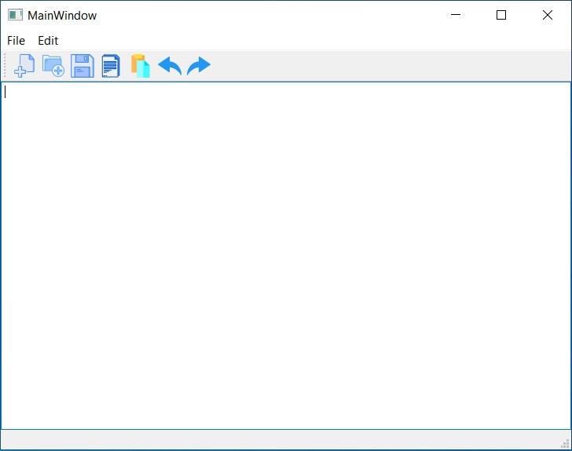
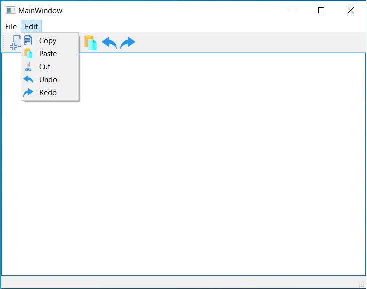

# Create Own Simple NotePad using C++
## About NotePad Application

   <body> This Notepad can handle basic few opperations. 
   

       <ul>
           <li>Add New File</li>
           <li>Open File</li>
           <li>Save File</li>
           <li>Copy</li>
           <li>Paste</li>
           <li>Cut</li>
           <li>Undo</li>
           <li>Redo</li>
           <li>Exit</li>
       </ul>
 

 
Are you interst to develope....!! Please Do it....!!

   </body>

## Open File Menu
 

 
## Open Edit Menu
 

 Thank You....!!

